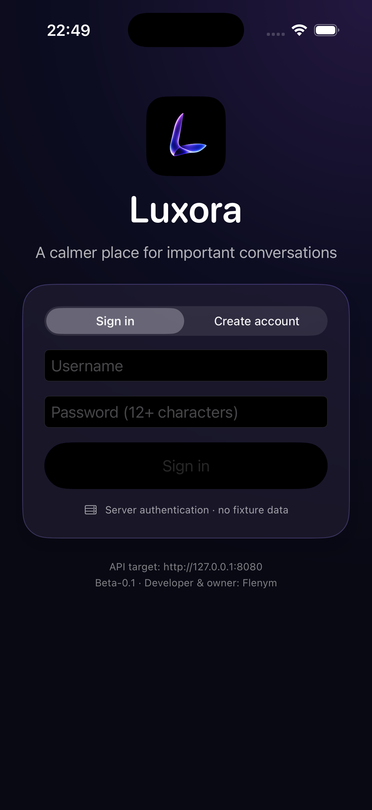
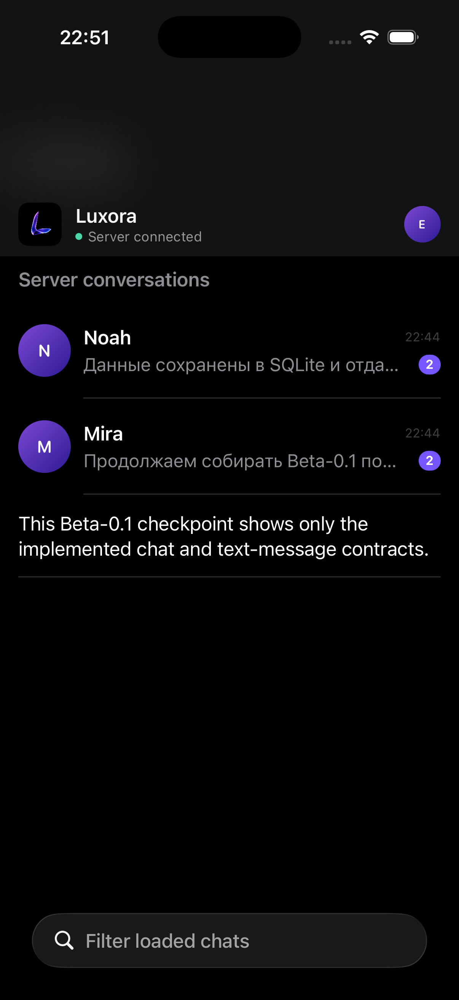
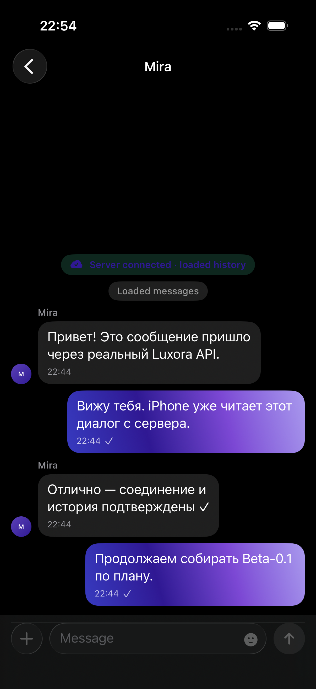

<div align="center">

🇬🇧 English &nbsp;·&nbsp; <a href="README.ru.md">🇷🇺 Русский</a>

<br/><br/>


# Luxora

> A premium messenger for personal conversations and meaningful communities.

*The privacy model is understandable before the first message — and the interface never hides real delivery states.*

<br/>

[](CHANGELOG.md)
[](SECURITY.md)
[](LICENSE)
[](ROADMAP.md)

<br/>

[](https://github.com/Flenym/Luxora/stargazers)
[](https://github.com/Flenym/Luxora/network/members)
[](https://github.com/Flenym/Luxora/issues)
[](https://github.com/Flenym/Luxora/actions)

<br/>

<a href="https://github.com/Flenym/Luxora">⭐ GitHub</a> &nbsp;·&nbsp;
<a href="ARCHITECTURE.md">🏛 Architecture</a> &nbsp;·&nbsp;
<a href="ROADMAP.md">🗺 Roadmap</a> &nbsp;·&nbsp;
<a href="SECURITY.md">🔒 Security</a> &nbsp;·&nbsp;
<a href="https://github.com/Flenym/Luxora/issues">💬 Issues</a>

</div>

---

## ✨ What is Luxora?

**Luxora** is a premium, protocol-first messenger being built in the open — calm, luminous and exact.

Most messengers ask you to trust vague words: *"secure"*, *"delivered"*, *"online"*. Luxora takes the opposite approach:

- 🔍 **Honest privacy.** The trust mode is visible before you write anything. No lock icon that means nothing.
- 📬 **Honest delivery.** *Sent*, *Delivered* and *Read* appear only when the protocol can prove them — never simulated by a timer.
- 🧩 **One protocol, many native clients.** iPhone, Android, Web and Desktop share identical message, identity and privacy semantics — with fully native UX on each platform.
- 🛡 **Security as a gate, not a slogan.** End-to-end encryption and calls ship only after independent audit and end-to-end evidence — never as a marketing claim.

> Current state: **Beta-0.1 · Cloud preview**. Connections are protected in transit, message bodies can be envelope-encrypted at rest — but the server processes plaintext. **This build is not end-to-end encrypted. Don't use it for sensitive information.**

---

## 💜 Vision

<div align="center">

> *“Premium never permits a misleading security symbol.”*

</div>

Luxora is built on five principles:

| # | Principle | What it means |
|---|-----------|---------------|
| 01 | **Truth before polish** | No client may invent a receipt, a security state or a capability the protocol cannot prove. |
| 02 | **Calm by design** | Deep neutral surfaces, one restrained violet ribbon for focus, motion that explains continuity — never noise. |
| 03 | **Privacy you can read** | `Cloud preview` today. `Private` (audited E2EE) and `Moderated` only after their gates pass. The label always tells the truth. |
| 04 | **Server first, then clients** | One complete server platform → one complete iPhone app → every other platform. No divergence of semantics across seven clients. |
| 05 | **Evidence over promises** | Every claim ships with tests, gates and review. Roadmap features are never shown as working without a `prototype` / `coming later` mark. |

The destination: a messenger that feels like a quiet, luminous space — where every pixel, every state and every word about privacy is earned.

---

## 🎛 Capabilities

### 🟢 Available — Beta-0.1

Real, tested foundations (not mockups):

|  | Capability | Description |
|---|---|---|
| 📜 | **Shared protocol** | Strict Zod contracts for HTTP + realtime: identities, chats, messages, receipts, errors, limits |
| ⚙️ | **Backend core** | Node.js 22 + Fastify, SQLite WAL with transactional migrations, health/readiness, OpenAPI, Prometheus metrics |
| 🔑 | **Auth & sessions** | Argon2id login, short-lived JWT, hash-only rotating refresh tokens, per-device sessions with revoke |
| 📱 | **Phone onboarding** | Strict E.164 + 6-digit OTP, registration / login branching, username suggestions, recovery & legacy binding slices |
| 💬 | **Messaging** | Directs, groups, channels · text · replies · forwards · edit history · pins · reactions · read receipts |
| 🗂 | **Organization** | Chat folders, archive & mute, synchronized drafts, scheduled send, topics foundation, invite links, join-request approval queues |
| 🛡 | **Safety** | Privacy-filtered discovery, message requests, directed blocks, selected-evidence reports |
| ⚡ | **Realtime** | Authenticated WebSocket V2 with cursor replay, heartbeat, backpressure, typing & presence |
| 📦 | **Media staging** | Resumable encrypted upload, authorized storage, byte-range download, quota & orphan handling |
| 🐳 | **Hardened runtime** | Distroless non-root container, digest-pinned images, Trivy-clean, loopback-first local stack |

### 🟡 In Development

Active work — visible in code, not yet shippable as product:

|  | Area | Direction |
|---|---|---|
| 👑 | Ownership transfer | Two-step ceremony with revision protection |
| 🎙 | Voice messages | End-to-end QA: record → upload → playback → consent-based transcript |
| 🖼 | Media processing | Server-side thumbnails, waveform / duration extraction, quarantine & transcode pipeline |
| 🔎 | Search completion | Global pagination, contacts policy, permission-first guarantees |

### 🔵 Planned

Explicit roadmap phases — **not** working features:

|  | Area | Gate |
|---|---|---|
| 📞 | Calls platform | Versioned signaling, SFU / TURN, screen share — only after security review + lab evidence |
| 🔐 | Private E2EE | Audited 1:1 & group crypto, key transparency, verification UX, independent audit |
| 🔔 | Real push delivery | APNs / FCM / Web Push credentials, minimized payloads, measured delivery |
| 📲 | Passkeys for everyone | Public signup / sign-in / management UX after abuse, recovery & interop gates |
| 🌍 | Production platform | Production DB, scaling, backups & DR, monitoring, external pentest |

> **Truth rule:** anything in 🟡 or 🔵 is never presented in the product as already working.

---

## 📱 Experience

<div align="center">

| Onboarding | Chats | Conversation |
|---|---|---|
|  |  |  |
| Phone-first · OTP · profile | Live server data · honest states | Replies · receipts · reactions |

*Live Simulator frames against a real local API — the thin iPhone integration harness proving actual contracts.*

</div>

What using Luxora feels like (and will feel like as phases complete):

- 🌑 **Deep calm** — quiet reading surfaces (`#090914`), one luminous violet ribbon (`#7C48D4 → #373ABF`) reserved for focus.
- ⌨️ **Speed with integrity** — optimistic send with same-nonce retry, explicit *Sending / Sent / Delivered / Read / Retry* states.
- 🔕 **Control** — folders, archive, mute, per-category notification preferences, quiet message requests from strangers.
- ♿️ **Accessible by default** — Dynamic Type, VoiceOver semantics, Reduced Motion & Transparency, high contrast.
- 🌐 **Russian-first, global-ready** — the iPhone client ships with a Russian phone-first onboarding; locale-aware dates, counters and layouts.

Brand, tokens, glass and motion rules: [DESIGN.md](DESIGN.md) · [ANIMATIONS.md](ANIMATIONS.md)

---

## 🖥 Platforms

One protocol — native experience everywhere. Strict build order: **server → iPhone → everything else**.

| Platform | Technology | Status |
|---|---|---|
| 🌐 Server / API | Node.js 22 · Fastify · SQLite WAL | 🟢 Runnable foundation — the active focus |
| 📱 iPhone | Swift 6 · SwiftUI · Keychain | 🟡 Thin integration harness, live contract evidence |
| 📲 iPad | Shared Swift foundation | ⚪ Frozen until server + iPhone are stable |
| 💻 macOS | SwiftUI probe | ⚪ Frozen — portability probe |
| 🤖 Android | Kotlin · Jetpack Compose | ⚪ Foundation, not API-connected |
| 🌍 Web | React + Vite | ⚪ Landing + local prototype, not a network client |
| 🪟💻 Windows / Linux | Hardened Electron shell | ⚪ Packaging probe, no messaging integration |

Details: [CLIENTS.md](CLIENTS.md) · [MOBILE.md](MOBILE.md) · [WEB.md](WEB.md) · [DESKTOP.md](DESKTOP.md)

---

## 🗺 Roadmap

No dates — phases are workstreams with exit gates, not promises.

### 🟢 Now — complete the server platform

Text vertical slice hardening · identity / devices / access · full chat & community domain · media processing · search / push / realtime completion · audited calls & E2EE subsystems · production operations.

### 🔵 Next — complete iPhone

Every planned flow on stable server capabilities: onboarding, chat, media, search, calls, privacy — plus offline-first storage, accessibility, performance and App Store gates. No demo fallback on any working surface.

### 🟣 Future — all remaining clients & public site

iPad → macOS → Android → Web → Windows / Linux → public site. Each adopts proven contracts and passes its own truth gates.

```
1. COMPLETE SERVER PLATFORM
   ↳ thin iPhone harness verifies contracts only
2. COMPLETE iPHONE PRODUCT
3. UNFREEZE iPAD / macOS / ANDROID / WEB / WINDOWS / LINUX / PUBLIC SITE
```

Full breakdown: [ROADMAP.md](ROADMAP.md) · execution queue: [TODO.md](TODO.md) · release bar: [docs/specs/RELEASE_QUALITY_GATES.md](docs/specs/RELEASE_QUALITY_GATES.md)

---

## 🔮 Future

When the gates pass, Luxora becomes:

- 🔐 **Private spaces** — verified end-to-end encrypted conversations with key verification and transparency, where even the server sees only opaque envelopes.
- 👥 **Moderated spaces** — communities with roles, audit log, slow mode and appeals — with explicit pre-join disclosure of what's processed and why.
- 📞 **Calls that earn trust** — 1:1 and group voice / video with verified encryption state, honest network adaptation and no fake "protected" badge.
- 🔎 **Search without leaks** — permission-first search everywhere; Private content indexed locally only, never as server plaintext.
- 📦 **Data dignity** — export, retention lifecycle and account deletion that actually propagate — backups included.

Nothing here is claimed as done. Each line has a gate, and each gate demands evidence.

---

## 🚧 Project status

<div align="center">

### 🚧 Active Development — `Beta-0.1` technical preview

*Runnable local foundation · tested slices · gated later-phase work · not a production service.*

Owner & developer: **Flenym** · CI: Node · Apple Swift · Apple IPA · Security — green on `main`

</div>

- ✅ What works is listed under **Available** above and proven by suites (protocol + API integration tests, Swift contract tests, Simulator journeys).
- 🚧 What is in progress is listed under **In Development**.
- 🔵 Everything else is roadmap with explicit gates.
- ⛔️ Beta-0.1 is **not** E2EE, has **no** working calls, **no** real push delivery, **no** production SMS — and the product says so on every surface.

---

## 📚 Documentation

| Document | What you'll find |
|---|---|
| [ARCHITECTURE.md](ARCHITECTURE.md) | Current & target architecture, boundaries, sequencing |
| [ROADMAP.md](ROADMAP.md) / [TODO.md](TODO.md) | Phases, dependencies, open work |
| [BACKEND.md](BACKEND.md) / [API.md](API.md) | Service & HTTP / WebSocket contract |
| [DATABASE.md](DATABASE.md) | Schema, transactions, encryption scope |
| [SECURITY.md](SECURITY.md) | Honest security contract & mandatory gates |
| [DESIGN.md](DESIGN.md) / [ANIMATIONS.md](ANIMATIONS.md) | Brand, tokens, glass, motion, accessibility |
| [docs/specs/PRODUCT_REQUIREMENTS.md](docs/specs/PRODUCT_REQUIREMENTS.md) | Canonical product requirements |
| [docs/research/PRODUCT_RESEARCH.md](docs/research/PRODUCT_RESEARCH.md) | Telegram / WhatsApp / Signal / Discord / HIG research |
| [CONTRIBUTING.md](CONTRIBUTING.md) / [STYLEGUIDE.md](STYLEGUIDE.md) | Engineering process & conventions |
| [TESTING.md](TESTING.md) / [DEPLOY.md](DEPLOY.md) | Test strategy / local preview & production prerequisites |
| [CHANGELOG.md](CHANGELOG.md) | History of the single public label Beta-0.1 |

---

## 🤝 Community & contributing

Luxora is developed in the open by **Flenym** — and thoughtful outside input is welcome.

- 💡 **Ideas** — open an [issue](https://github.com/Flenym/Luxora/issues) with the user outcome and the phase it belongs to.
- 🐞 **Bug reports** — synthetic data only, with build / commit, repro steps and expected vs actual behavior.
- ✨ **Feature proposals** — check [ROADMAP.md](ROADMAP.md) first; frozen clients don't accept new semantics early.
- 🔀 **Pull requests** — small, scoped, tested; auth / crypto / migration changes need independent review.
- 🔒 **Security reports** — never file exploits publicly; see [SECURITY.md](SECURITY.md#11-vulnerability-reporting).

The full contract: [CONTRIBUTING.md](CONTRIBUTING.md). Be kind, be precise, be honest about what's done.

---

## 📄 License

Open source under the **[MIT License](LICENSE)** — © 2026 Flenym.

Use it, fork it, learn from it. Keep the privacy claims as honest as you found them. 💜

---

<div align="center">


**Luxora** — *calm, luminous, exact.*

🇬🇧 English &nbsp;·&nbsp; <a href="README.ru.md">🇷🇺 Русский</a>

</div>
